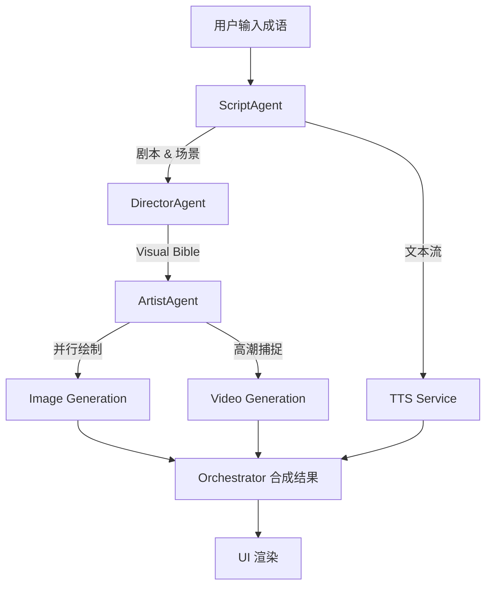

# 🏛️ Architecture & MAS Design

## 1. 系统概览
本项目采用纯前端的智能体编排架构，所有逻辑通过 Google Gemini API 在客户端安全执行。

## 2. Agentic Workflow (智能体流)

## 3. 关键技术选型

- **Gemini 3 Pro**: 用于剧本和视觉导演任务，需要极强的逻辑推理能力。
- **Gemini 2.5 Flash Image**: 用于图像生成，速度快且支持一致性 Prompt。
- **Gemini 2.5 Flash Native Audio (TTS)**: 原生音频生成，音质自然。
- **Veo 3.1**: 目前最顶尖的视频生成模型之一。

## 4. 一致性保障机制
为了解决 AI 绘图中常见的“断层”问题，我们引入了 **DirectorAgent**。它不直接绘图，而是生成一段包含：
- **Character Consistency String**: 描述主角的长相细节、衣着颜色。
- **Art Style Fixed Prompt**: 强制统一四张图的渲染风格（如：Claymation, Ink Wash）。
这确保了即使是四次独立的 API 调用，产出的结果也像出自同一人之手。
